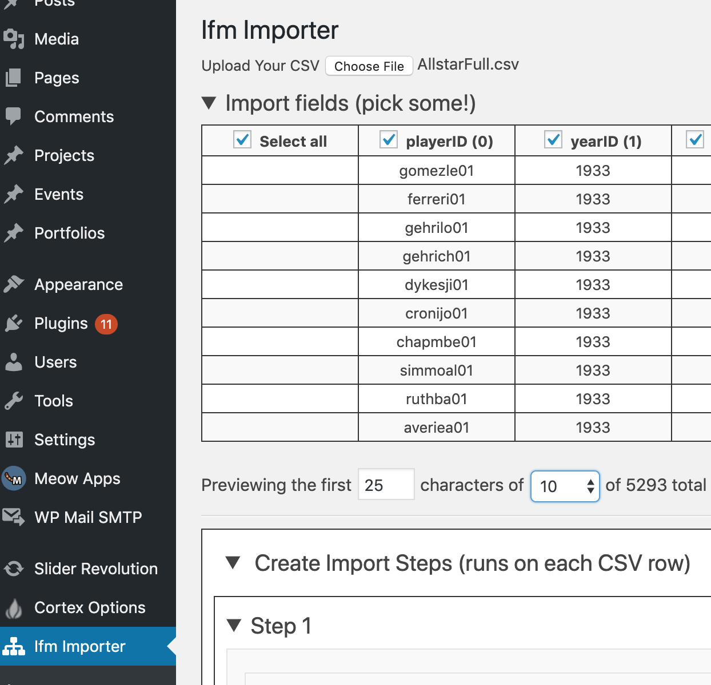
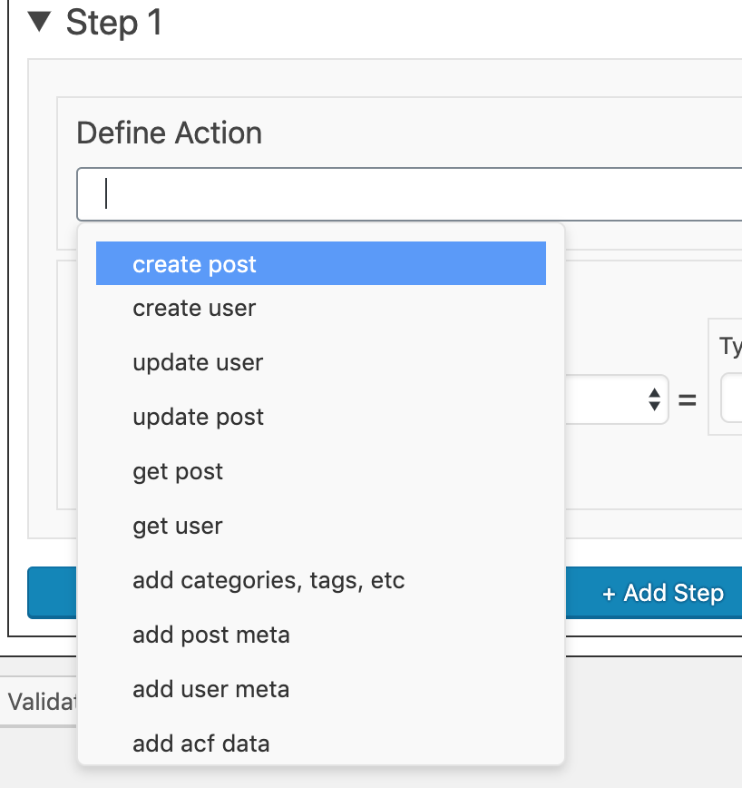
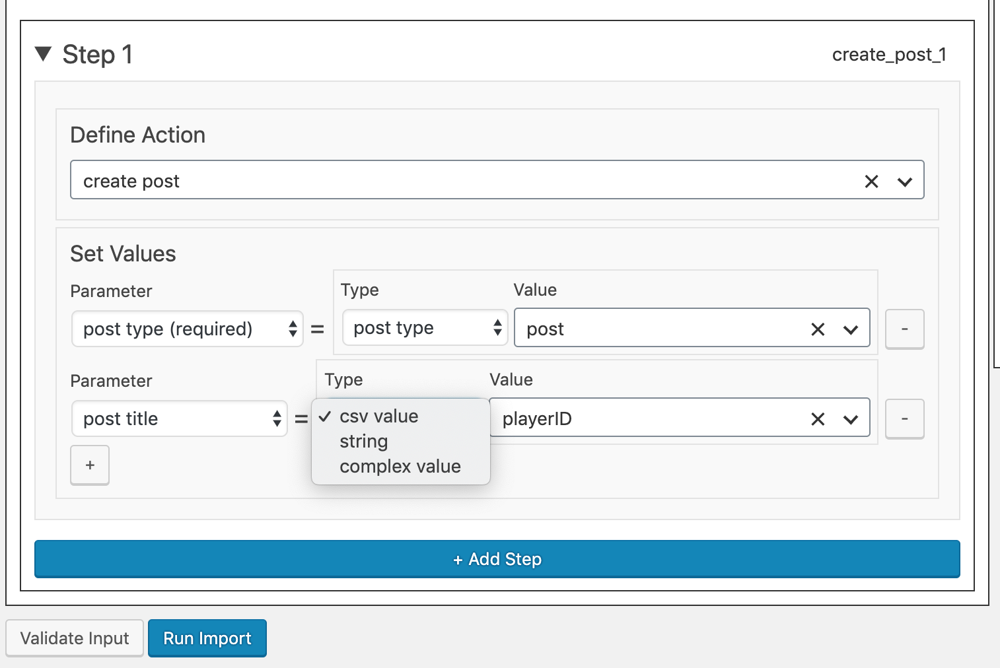
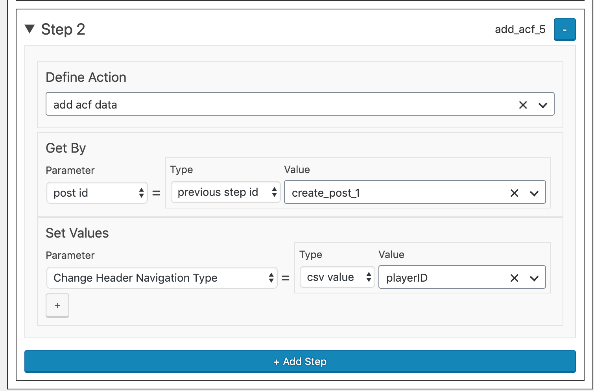
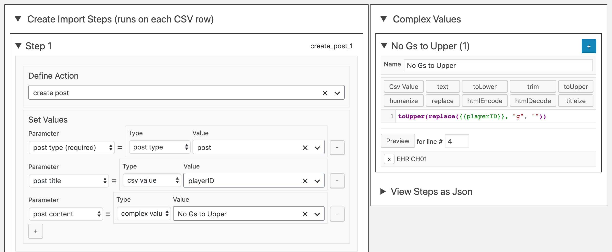

# WordPress Importer

Turn flat CSVs into complexly related data. Alpha version; powerful, but under active development.

## Key Features

- "Remembers" data from previous steps, allowing you to dynamically create and update posts with the CSV data.
- Custom scripting language for CSV value manipulation.

## Using the Plugin

### Step 1: Add to WordPress and activate.

### Step 2: Upload CSV

You can select as many fields as you like to be available to your import steps. Preview as many or as few records as you like.

### Step 3: Create Import Steps

Build your import by steps. Current available actions are as pictured. I plan on expanding these in later versions.

- create post
- create user
- update user
- upate post
- get post
- get user
- add categories, tags, etc. (taxonomy)
- add post meta
- add user meta
- add acf meta

Choose an action, then start setting parameters, value-types, and values. The base value types are:

- csv value -- _column names drawn from the uploaded csv_
- string -- _short bit of text, like "publish" for post status_
- step id -- _see section 3.1_
- complex value -- _see section 3.2_
   

### 3.1 Adding Steps

You can stack on any other steps you'd like, but one of the main strengths of this importer is that it can specifically reference the output value from a previous step to add more complex information, like Advanced Custom Fields, or post meta. So in this case, you can add ACF data to a post that you get by post id, from a previous `create post` or `get post` action/step. Same for any meta data, or anything else you can imagine.
 

### 3.2 Using Complex Values

To the right, you'll see a dropdown for creating custom vars, which you can build up from CSV values and various string manipulation functions. Your named var will then be available to the importer. More options to be added soon. 

### Step 4: Run Import

"Progress monitoring" currently under development.

## Tools Used

[Vue](https://vuejs.org/),
[Vuex](https://vuex.vuejs.org/)

[Codemirror](https://codemirror.net/doc/manual.html)

[WP-API javascript wrapper](http://wp-api.org/node-wpapi/using-the-client/#uploading-media)

[Vue-wp-starter](https://github.com/tareq1988/vue-wp-starter)

## 🚚 Development

1. Clone this repository in your plugins folder.
1. Run `npm install` and `composer install`
1. To develop: run `npm run start`
1. For production build, run `npm run build` and `composer install --save-dev`, then change the asset names in `includes/class-assets.php` from admin.js to admin.min.js, etc.
